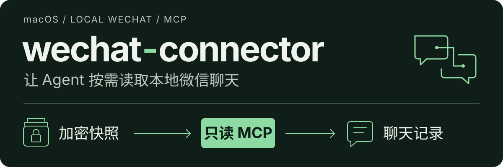

# wechat-connector



让 Agent 读取 Mac 微信聊天记录的本地 MCP 服务。支持显示联系人昵称、微信号和备注，
并按指定会话、时间范围分页读取可读历史，按需展开单条消息详情。

**首次由用户主动获取密钥，日常只读加密快照。** MCP 不发送消息、不启动或注入微信、
不自动获取密钥、不自动刷新数据，也不直接读取微信正在使用的数据库。

> [!WARNING]
> 本项目不是腾讯官方接口。首次初始化会重签名微信副本并插桩，存在账号限制或封禁风险，不保证免封号。
> 聊天正文会进入 Agent 上下文；使用远端模型时可能离开本机。使用前请阅读文末“风险警告”。

## 快速开始

### 1. 从 GitHub 运行

要求 macOS、Python 3.11+、uv、Git 和 SQLCipher。首次初始化方法此前在 Apple Silicon、微信 4.1.13 上跑通，
其他微信版本没有兼容保证。

```bash
brew install uv git sqlcipher
```

无需手动克隆仓库或进入项目目录，`uvx` 会从 GitHub 获取代码、安装依赖并复用隔离的 Python 环境。
SQLCipher 仍需由 Homebrew 安装。先确认命令能启动：

```bash
uvx --from git+https://github.com/yoko19191/wechat-connector.git@main \
  wechat-connector --help
```

本文统一从 GitHub 的 `main` 分支运行，不依赖 PyPI。不要省略 `--from` 直接运行 `uvx wechat-connector`。
首次运行需要联网下载；更新代码的方法见“更新 GitHub 版本”。

MCP 客户端配置需要 `uvx` 的绝对路径，在终端执行：

```bash
command -v uvx
```

将后文 `/opt/homebrew/bin/uvx` 替换为实际返回值；Intel Mac 可能不同。GitHub 来源地址可直接保留。

### 2. 准备密钥和第一份快照

| 你的情况 | 应做什么 |
|---|---|
| 新用户，没有密钥 | 在终端执行下面的 `init` |
| 已有用户级密钥和快照 | 跳过初始化，直接连接 MCP |
| 已有密钥，没有快照 | 正常退出微信，再执行 `snapshot`，见“刷新数据” |
| 已有旧项目的密钥和快照 | 使用“导入已有数据”，无需再次捕获 |

**首次初始化存在账号风险：** 它会重签名一个微信副本并对该副本进程插桩，腾讯可能检测到这些操作。
这不是腾讯授权接口，不保证免封号；请在理解风险后自行决定是否初始化。

先在原版微信登录需要读取的账号，确保聊天数据已存在于本机，再正常退出微信。
然后在交互式终端执行；`[init]` 用于安装首次捕获所需的 Frida：

```bash
uvx --from 'wechat-connector[init] @ git+https://github.com/yoko19191/wechat-connector.git@main' \
  wechat-connector init
```

程序会说明风险并要求输入 `YES`。之后按提示完成：

1. 程序检查原版签名，创建并处理本次专用应用副本；不修改原版微信，不关闭 SIP。
2. 程序启动副本并等待密钥派生；如果出现登录提示，由你在手机上确认登录所选账号。
3. 所有目标分库密钥通过认证后，原子保存到本地。
4. **正常退出副本**，按提示继续生成第一份加密快照。完成后会输出 `"ready": true`。

若发现多个账号目录，按错误提示增加 `--account <账号目录名>`。自定义数据位置使用 `--root <xwechat_files目录>`。
如果 macOS 拒绝访问源目录，请检查运行命令的终端是否具有相应文件访问权限。

密钥已保存但快照失败时，先解决提示的问题，再运行 `snapshot`；再次执行 `init` 也会复用已有密钥。
捕获超时或中断后，请正常退出副本。程序不会强制退出已运行的微信，也不会自动覆盖旧密钥。

### 3. 连接 MCP 客户端

连接使用 **stdio**：客户端通过 `uvx` 启动服务并管理它的生命周期。
不需要手动保持一个运行 `serve` 的终端，也没有需要填写的 HTTP URL。
日常配置使用不带 `[init]` 的来源；查询环境不要求 Frida，服务不会导入捕获模块。

#### Codex

确认下方 `uvx` 路径与本机一致后，在终端执行一次：

```bash
codex mcp add wechat-connector \
  --env PATH=/opt/homebrew/bin:/usr/local/bin:/usr/bin:/bin:/usr/sbin:/sbin \
  -- /opt/homebrew/bin/uvx \
  --from git+https://github.com/yoko19191/wechat-connector.git@main \
  wechat-connector serve
```

这会添加用户级 MCP 配置。也可以改用 TOML，将下面的块合并到 `~/.codex/config.toml`，
**不要覆盖整个配置文件，也不要重复添加同名配置块**：

```toml
[mcp_servers.wechat-connector]
command = "/opt/homebrew/bin/uvx"
args = ["--from", "git+https://github.com/yoko19191/wechat-connector.git@main", "wechat-connector", "serve"]
startup_timeout_sec = 60

[mcp_servers.wechat-connector.env]
PATH = "/opt/homebrew/bin:/usr/local/bin:/usr/bin:/bin:/usr/sbin:/sbin"
```

TOML 示例允许首次准备依赖等待 60 秒；CLI 添加后若启动超时，也可补充该设置。
用 `codex mcp get wechat-connector` 检查配置，然后重新加载 MCP 连接或重启客户端。

#### mcp.json 配置（完整 JSON）

如果客户端通过 `mcp.json`（有些客户端命名为 `.mcp.json`）管理 MCP，
下面是使用 `mcpServers` 结构的完整配置。文件位置以客户端要求为准，
不是放进本项目目录就会自动生效。已有配置时只合并 `wechat-connector` 条目，保留其他服务。

GitHub 来源地址可直接使用；用 `command -v uvx` 确认并替换命令路径：

```json
{
  "mcpServers": {
    "wechat-connector": {
      "command": "/opt/homebrew/bin/uvx",
      "args": [
        "--from",
        "git+https://github.com/yoko19191/wechat-connector.git@main",
        "wechat-connector",
        "serve"
      ],
      "env": {
        "PATH": "/opt/homebrew/bin:/usr/local/bin:/usr/bin:/bin:/usr/sbin:/sbin"
      }
    }
  }
}
```

显式 `PATH` 用于让 GUI 客户端找到 Homebrew SQLCipher。配置中不填写密钥值。
本项目不会自动修改客户端设置；本机以前生成的 `.local/` 配置文件不随 Git 分发，新用户使用上面的示例即可。

#### 在“MCP 配置向导”中怎么填

如果客户端提供类型、标题、命令、参数和环境变量表单，按下面填写即可生成等价配置：

| 表单字段 | 填写内容 |
|---|---|
| 类型 | 选择 `stdio` |
| MCP 标题（唯一） | `wechat-connector`；已存在同名项时编辑原有配置 |
| 命令 | `/opt/homebrew/bin/uvx`，或 `command -v uvx` 返回的实际路径 |
| 参数 | 下方四行，每行一个参数 |
| 环境变量 | 下方 `PATH=...` 一行 |

**参数栏：** 第二行是 GitHub 来源地址，可直接复制。

```text
--from
git+https://github.com/yoko19191/wechat-connector.git@main
wechat-connector
serve
```

**环境变量栏：**

```text
PATH=/opt/homebrew/bin:/usr/local/bin:/usr/bin:/bin:/usr/sbin:/sbin
```

命令栏只填可执行文件路径，不要把整条终端命令粘进去。
参数栏不加 JSON 的逗号或引号；路径含空格时仍作为完整的一行，不要拆开。
不要填 HTTP/SSE 地址、`init` 或密钥值。点击“应用配置”并保存后，重新加载 MCP 连接。

### 4. 确认连接成功

客户端应能发现这三个工具：

| 工具 | 用途 | 参数 |
|---|---|---|
| `wechat_list_chats` | 按名称/备注/微信号查找会话，或浏览列表 | `query?`、`account?`、`limit=20`、`cursor?` |
| `wechat_get_chat_history` | 按会话和时间读取可读历史 | `chat_id`、`account?`、`start_time?`、`end_time?`、`limit=20`、`cursor?` |
| `wechat_get_message` | 单条消息详情、来源和长正文续读 | `message_ref`、`cursor?` |

可以直接对 Agent 说：

> 使用微信工具列出最近活跃的 20 个会话，显示备注名、昵称和 chat_id。

如果连接成功但查询返回 `KEYS_NOT_FOUND`，说明尚未初始化；服务不会替你捕获密钥。

## 如何找到对方并读取聊天

### 从名称取得 chat_id

先按名称片段调用 `wechat_list_chats`，无需遍历所有联系人：

```json
{"query": "某某", "limit": 5}
```

`query` 匹配备注、昵称、微信号或内部标识，采用去除首尾空白后的 Unicode 大小写无关子串匹配，
不是模糊搜索，也不把 `%` / `_` 当通配符。同名候选全部返回，由你选择。
省略 `query` 才是浏览全部会话；空白查询会报 `INVALID_QUERY`。翻页时保持同一查询条件。

在结果的 `rows` 中，根据以下字段确认对象：

| 字段 | 含义 |
|---|---|
| `display_name` | 展示名称，优先级为备注名 → 昵称 → 微信号 → 内部用户名 |
| `remark` | 你设置的备注名，可能为 `null` |
| `nickname` | 对方昵称或联系人库记录的群名称，可能为 `null` |
| `alias` | 联系人库的 alias，通常是自定义微信号，可能为 `null` |
| `chat_id` | 聊天对象的内部标识，用于准确定位会话；MCP 不再重复返回 `username` |
| `last_activity` | 带时区的最近活动时间 |
| `account` | 本地微信账号目录标识，多账号查询时需要原样传回 |

`chat_id` 来自消息库的 `Name2Id.user_name`，不是昵称，也不一定等于自定义微信号。
个人会话常见 `wxid_...`，群会话常见 `...@chatroom`。**从同一行复制 `chat_id` 和 `account`，不要用昵称代替。**
名称按“本地账号＋内部用户名”关联；缺少联系人记录时回退到内部标识，不靠同名昵称猜测身份。

### 读取指定时间段

以下示例读取北京时间 **2026 年 9 月 1 日至 3 日**的完整日期范围。
将 `chat_id`、`account` 替换成会话列表返回的实际值，再调用 `wechat_get_chat_history`：

```json
{
  "chat_id": "<会话列表返回的 chat_id>",
  "account": "<同一行的 account>",
  "start_time": "2026-09-01T00:00:00+08:00",
  "end_time": "2026-09-04T00:00:00+08:00",
  "limit": 100
}
```

- 时间范围为 **[开始时间, 结束时间)**：包含开始，不包含结束。整天查询的结束时间应设为次日零点。
- 时间必须带 `Z` 或明确的时区偏移；`+08:00` 表示北京时间，不自动使用 Mac 的本地时区。
- 开始和结束都可省略，也可只指定一个；支持最多六位小数秒，开始必须早于结束。
- 单账号可省略 `account`；多账号历史查询必须指定。
- 返回的是该会话的双向聊天记录，不是该用户在所有群里的发言。结果按时间等字段稳定倒序排列。

也可以直接让 Agent 执行：

> 先从微信会话列表找到备注为“某某”的人；如果重名，让我选择。读取与此人在北京时间 9 月 1 日至 3 日的聊天，继续翻页直到该时间段全部读完，再总结。

### 超过一页怎么办

每页请求上限为 100 条，但不是保证返回 100 条。0.2.0 优先保留完整正文，完整 MCP 工具结果限制为 **16 KiB UTF-8**，放不下下一条时提前结束当前页。结果包含 `has_more` 和 `next_cursor`：

1. `has_more` 为 `true` 时，用 `next_cursor` 再调用同一个工具。
2. 下一页保持相同 `chat_id`、`account`、`start_time`、`end_time`，只增加或替换 `cursor`。
3. 继续到 `has_more` 为 `false`，不要把第一页当成全部聊天。

游标绑定快照、工具、账号、名称查询或会话时间范围，不能交叉使用。游标只按最后实际返回的记录推进，不会越过尚未返回的消息。名称可能重名，消息不会自动去重。
所有结果还包含 `snapshot_id`、`snapshot_created_at` 和 `live: false`；名称、备注和消息均以该快照为准。

## 0.2.0：读取结果与单条详情

**完整数据仅在 `structuredContent` 中返回。** MCP 文本 `content` 只是一条不超过 200 字符的提示，
不是聊天正文；客户端必须把结构化结果提供给 Agent。不会把同一份 JSON 复制到两个字段。
16 KiB 预算包括结构化结果、提示文本和分页元信息，不等同于固定 token 数。

历史页共享 `chat`、`participants` 和 `time_range`。`rows` 中的每条消息包含：

| 字段 | 含义 |
|---|---|
| `message_ref` | 当前服务进程内的短引用，用于读取详情 |
| `time` | UTC RFC3339 时间；无法解释的时间为 `null` |
| `speaker` | 本页 `participants` 中的键，例如 `p0`；必须用本页映射解释 |
| `kind` | `text`、`reply`、`file`、`image`、`voice`、`video`、`emoji`、`link`、`system` 或 `unsupported` |
| `text` | 普通文字为原文，其他类型为确定性提取的可读内容 |
| `status` | `ok` 或明确的解析/类型错误，不能忽略错误并声称已读全 |
| `reply_to` | 引用消息存在时的直接引用来源信息；不展开整条历史引用链 |
| `content_complete` | 当前消息的内容是否完整 |
| `content_offset` | 当前文本片段在规范化内容中的 Unicode 字符偏移 |
| `next_content_cursor` | 仅当单条消息超出预算时提供，用于继续读取该消息 |

文件返回名称、类型和大小；链接卡片返回标题、描述及净化链接；图片等只返回类型和已有说明，
不会猜测媒体内容。协议 XML、附件 AES 密钥、上传令牌和内部签名不进入普通查询或详情。
微信文章链接只保留文章定位参数；其他链接移除用户凭据、查询参数和片段，`link_sanitized` 标明是否净化。
用户手工写在普通聊天正文中的敏感信息不保证自动识别。

### 单条消息详情与长消息续读

绝大多数消息会完整返回，只减少每页条数。**只有一条消息独自也超过预算时才分段**。
此时历史结果可能同时出现：`has_more: false`（没有其他消息），但 `content_complete: false`（这条消息尚未读完）。

把该行的引用和内容游标传给新工具：

```json
{
  "message_ref": "<历史结果中的 message_ref>",
  "cursor": "<该行的 next_content_cursor>"
}
```

以上参数用于 `wechat_get_message`。它返回 `message`、必要的 `source` 信息、`has_more` 和 `next_cursor`。
继续传入同一 `message_ref` 和新 `next_cursor`，按 `message.content_offset` 拼接 `message.text`，
直到没有下一段。省略 `cursor` 则从消息开头读起，用于查看详情或来源。
所有需要暴露的 64 位来源 ID 都是字符串，避免 JavaScript 整数精度损失。

短引用绑定服务进程、快照、账号、会话和原始记录；最多保留 4,096 条。
服务重启或引用淘汰后会返回 `MESSAGE_REF_EXPIRED`，重新查询历史即可获得新引用。
它不是持久的数据库 ID，也不能用来读取文件路径或任意 SQL。

超过 16 MiB 解码保护的消息报告 `MESSAGE_TOO_LARGE`；损坏、未知内容报告明确状态，
不当作空消息、不静默跳过，也不通过详情返回原始 XML。状态非 `ok` 且没有内容游标时，不要无限重试。

### 从 0.1.x 升级

这是返回结构升级，版本为 **0.2.0**。两个旧工具名称保留，新增 `wechat_get_message`；
旧游标失效，需重启客户端并重新发现工具。调用方应读取 `structuredContent`，
使用 `text`、带时区的 `time` 和页头参与人映射，不再依赖逐行原始数据库字段。
CLI 的原始行读取保留用于本地核验，可能包含协议 XML，不应将该原始输出直接充当精简 MCP 返回。

## 刷新数据与终端查询

**新消息不会自动进入已有快照。** 先正常退出微信，再手动执行：

```bash
uvx --from git+https://github.com/yoko19191/wechat-connector.git@main \
  wechat-connector snapshot
```

成功后可以重新打开微信。MCP 在首次成功查询时固定一份快照，**刷新后需要重启 MCP 连接**才能使用新数据。
微信中改过备注名，也要这样刷新才能看到更新。

无需 MCP 客户端，也能直接在终端查询：

```bash
uvx --from git+https://github.com/yoko19191/wechat-connector.git@main \
  wechat-connector read --limit 20

uvx --from git+https://github.com/yoko19191/wechat-connector.git@main \
  wechat-connector read \
  --chat '<chat_id>' \
  --start-time '2026-09-01T00:00:00+08:00' \
  --end-time '2026-09-04T00:00:00+08:00' \
  --limit 100
```

CLI 只返回范围内最近的 `limit` 条；完整遍历请使用 MCP 分页。

### 长期安装（可选）

如果希望直接使用 `wechat-connector` 短命令，可以从 GitHub 安装到持久的工具环境：

```bash
uv tool install 'wechat-connector[init] @ git+https://github.com/yoko19191/wechat-connector.git@main'
wechat-connector --help
```

若提示命令不在 PATH 中，执行 `uv tool update-shell` 后重开终端。
这不是上文 `uvx` 连接的前提；已有密钥且不需要再次捕获时，可去掉 `[init]`。

### 更新 GitHub 版本

`uvx` 会复用缓存。要获取 `main` 分支的最新代码，先执行以下命令，再重启 MCP 连接：

```bash
uvx --refresh-package wechat-connector \
  --from git+https://github.com/yoko19191/wechat-connector.git@main \
  wechat-connector --help
```

若使用的是 `uv tool install` 长期安装方式，更新命令为：

```bash
uv tool upgrade wechat-connector
```

需要固定代码版本时，将来源地址末尾的 `@main` 换成已核对的完整 commit SHA，并在初始化、查询和 MCP 配置中使用同一版本。

## 导入已有数据

已有旧项目的密钥和快照时，无需再次捕获：

```bash
uvx --from git+https://github.com/yoko19191/wechat-connector.git@main \
  wechat-connector init \
  --import-keys /absolute/path/to/old/captured-keys.jsonl \
  --import-snapshot /absolute/path/to/old/snapshot
```

把最后一个路径替换为实际目录。导入前验证密钥和加密快照，只迁移加密分支及回执；
旧密钥、旧明文快照和应用副本不会被删除。目标已有相同数据时复用，冲突时拒绝覆盖。
仅导入密钥时，会验证本地微信数据库，并要求微信退出后生成快照。

## 数据保存在哪里

```text
~/.local/wechat-connector-keys.jsonl             # 明文密钥，0600
~/.local/share/wechat-connector/                # 私有目录，0700
  snapshots/<时间戳>/
    encrypted/<账号>/db_storage/...            # 加密数据库，0600
    receipt.json                              # 快照时间、完整性、校验值
  init-.../WeChat.app                          # 初始化创建的应用副本
```

密钥文件不是机器通用的一把钥匙，而是一组账号/分库对应的密钥。它以明文 JSONL 保存，没有放进系统钥匙串。
程序检查所有权、文件权限，拒绝符号链接；允许 `~/.local` 为 `0755`，但不允许其他用户写入。
**不要把密钥文件、数据库或聊天内容提交到 Git、粘贴进 MCP 配置或发送给他人。**

MCP 每次调用都检查本地密钥文件；文件被删除后，下一次调用报错，不继续使用缓存密钥。
服务不向 Agent 返回密钥值，也不把密钥放进命令行参数或错误日志。

## 常见问题

| 现象或错误 | 处理方式 |
|---|---|
| 找不到 `uvx` / `sqlcipher` | 安装 uv、SQLCipher；检查配置中的绝对路径和 PATH |
| MCP 启动超时 | 先用 `--help` 预热 uvx；Codex 可设 `startup_timeout_sec = 60` |
| `KEYS_NOT_FOUND` | 用户在终端执行首次初始化，MCP 不会自动初始化 |
| `KEYS_INVALID` | 检查密钥格式、所有权和 `0600` 权限；不要覆盖已有文件 |
| `SNAPSHOT_NOT_FOUND` | 正常退出微信，再执行 `snapshot` |
| `KEY_MISSING` / `KEY_MISMATCH` | 新分库缺密钥或原密钥不匹配；停止，不自动重抓或跳过 |
| `ACCOUNT_REQUIRED` | 使用命令提示或会话列表中的账号标识 |
| `INVALID_TIME_RANGE` | 使用带时区的 RFC3339 时间，且开始早于结束 |
| `INVALID_CURSOR` | 从第一页重新开始，并保持账号、会话和时间范围不变 |
| `CONTACT_AMBIGUOUS` | 联系人库中同一内部用户名有冲突名称，程序未猜测身份 |
| `INVALID_QUERY` | 名称查询为空；填写名称片段，或省略 query 浏览会话 |
| `CURSOR_VERSION_MISMATCH` | 旧版游标已失效，从第一页重新查询 |
| `MESSAGE_REF_EXPIRED` | 服务已重启或引用已淘汰，重新查询历史 |
| `MESSAGE_PARSE_FAILED` / `UNSUPPORTED_MESSAGE` | 明确未完整解释原消息，不返回原始 XML |
| `MESSAGE_TOO_LARGE` | 超过单条 16 MiB 解码保护，不假装已返回完整内容 |
| `QUERY_TIMEOUT` | 数据库调用超过 30 秒，缩小时间范围后再试 |
| `SQLCIPHER_NOT_FOUND` | 安装 SQLCipher，并检查客户端进程 PATH |
| `DATABASE_READ_FAILED` / `SNAPSHOT_INVALID` | 检查数据库、快照完整性或表结构 |
| `INVALID_ARGUMENTS` | 检查工具参数；未知参数不会被静默忽略 |
| `READ_FAILED` | 未预期的读取错误；不会回退到原库或明文库 |
| 看不到刚收到的消息或新备注 | 手动刷新快照，再重启 MCP 连接 |

可用下面的只读诊断查看微信版本、数据路径和访问错误：

```bash
uvx --from git+https://github.com/yoko19191/wechat-connector.git@main \
  wechat-connector doctor
```

刷新期间程序检查微信已退出，将数据库及日志复制到私有目录，仅在副本上恢复、校验并发布。
源变化或失败会阻止新快照发布，上一份快照仍可使用。查询使用 SQLCipher 只读连接，在内存中解密，
不生成明文整库，不写回微信目录，单次数据库调用限制 30 秒。

## 开发与验证

以下仅供开发者使用。先克隆源码并进入项目目录：

```bash
git clone https://github.com/yoko19191/wechat-connector.git
cd wechat-connector
```

自动化测试和合成评测数据位于 `test/`。在项目根目录运行以下命令；基础测试环境不要安装 Frida，首次捕获测试使用单独环境：

```bash
uv venv .venv
uv pip install --python .venv/bin/python -e .
.venv/bin/python -m unittest discover -s test -t . -v

uv venv .local/init-test-venv
uv pip install --python .local/init-test-venv/bin/python -e '.[init]'
.local/init-test-venv/bin/python -m unittest -v test.test_capture_native
```

基础测试覆盖 WAL、认证、只读拒写、密钥缺失、迁移、中断、分页、时区边界、联系人查找、消息白名单解析、凭据过滤、响应预算、长消息续读和引用过期。
基础测试发现命令在未安装 Frida 时会跳过可选捕获测试；上面的独立命令再验证该测试。真实捕获桥接测试只运行合成 CommonCrypto 进程，不运行微信。
`test/evaluations.xml` 的十条固定合成问答通过 MCP 列表及分页结果校验，不包含真实聊天；这不是独立模型能力评测。

本机曾对一份 331,052 条消息的既有快照完成迁移前后逐行对比。拥有该基线的开发者可运行：

```bash
.venv/bin/python verify_existing_snapshot.py \
  --snapshot /absolute/path/to/old/snapshot \
  --against /absolute/path/to/migrated/encrypted-snapshot
```

本地性能/上下文回放仅输出统计，不导出聊天或凭据：

```bash
uv pip install --python .venv/bin/python -e '.[audit]'
.venv/bin/python audit_agent_tools.py --query '联系人甲' --query '联系人乙' --limit 50
```

名称需唯一匹配。脚本比较旧原始结构与新结构，验证可读内容及直接引用保留，并统计调用数、字节和延迟。
Token 使用本地 `tiktoken 0.14.0 / o200k_base`（可选 `cl100k_base`）计算，不调用远端模型，
也不声称这是当前模型的精确 tokenizer。

本机两段实际历史回放分别保留 36 / 50 条消息，结构化结果由 26,679 / 38,059 字节降到
11,413 / 11,751 字节，合计减少 **64.22%**；同一 `o200k_base` 编码下由 24,165 降到 7,911 tokens。
这不是通过删掉可读正文达成的，参数、原文及凭据未写入提交的测试样本。

本地打包：`uv build --out-dir .local/dist`。不会自动公开发布。
根目录旧脚本保留兼容入口；旧 `capture_keys.py` 已停用，首次获取仅通过交互式 `init` 执行。

## 风险警告

- **账号风险：** 本项目不是腾讯官方接口，也未获腾讯授权。初始化会重签名微信副本并对进程插桩，这些行为可能被检测，存在账号限制或封禁风险。日常只读快照不能消除先前初始化带来的风险，不保证免封号。
- **聊天隐私：** 聊天正文会进入调用工具的 Agent 上下文；如果宿主使用远端模型，正文可能发送到模型服务商。请确认客户端的数据处理方式，只读取你有权访问的数据。
- **密钥保管：** 密钥以明文文件保存在本机。文件权限检查不能替代设备安全；不要上传密钥、数据库、快照或含聊天内容的日志，也不要把它们提交到 Git。
- **版本与数据：** 微信升级可能导致初始化、表结构解析或查询失效。快照不是实时数据，也不应作为唯一备份；操作前自行保留必要备份，遇到错误时停止并检查原因。
- **不可信内容：** 聊天文本可能包含诱导 Agent 执行操作的指令，应始终作为数据处理，不能据此运行命令、泄露凭据或扩大工具权限。

请在理解上述风险后自行决定是否使用。“本地、只读、自用”不代表平台许可，也不构成账号安全或隐私安全保证。
